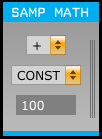
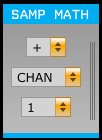

# Sample Math Plugin 

Plugin for the Open Ephys GUI to perform simple samplewise arithmetic (addition, subtraction, multiplication, division, summation and averaging) on continuous channels. For binary operations, the second argument can be either a constant or another channel.

 

## Installing:

* All platforms: Copy contents of "Source" into a new folder in your "Source/Plugins" called "SampleMath".
* Windows: Copy contents of "Builds/VisualStudio2013" into a new folder in your "Builds/VisualStudio2013/Plugins" called "SampleMath". In Visual Studio, with the Plugins solution open, right-click the solution, go to Add->Existing Project, then select the SampleMath.vcxproj file you just copied to add the new plugin. Then build as usual in Visual Studio.
* Linux: Use `make` to compile as usual.
* Mac: Not currently implemented, but should be easy to setup as a standard plugin in XCode.

## Usage:

* Top row: select which operation to perform on each processed input channel. The first four operations transform selected channels according to the second operand as selected below, whereas "SUM" and "MEAN" output the sum or mean of all selected channels on each selected channel.
* Middle row: select whether the second operand is constant or another channel.
* Bottom row: select that constant or channel.
* Channels can be included/excluded from processing by selecting/deselecting them in the "Param" section of the drawer. NOTE however that if a channel is selected as the second argument of the operation, only channels from the same source node and subprocessor may be included for processing. This is to ensure that the channels input to an operation always have the same number of samples per buffer (the plugin does not do any resampling).

## Testing (requires MATLAB and a connected acquisition board):

1. Open Open Ephys version 0.4.3.3 (master branch at time of writing)
2. Load the configuration file `Test/settings.xml`
3. Record for however long you want to test - probably less than a minute. The Rhythm FPGA and each instance of Sample Math will make its own recording of channels 1 and 2.
4. In MATLAB, run `check_sample_math_output(<recording directory>)`. It should plot a figure similar to `example_check_results.fig`, showing the error on each channel for each operation. Ensure that the errors are reasonably small.
